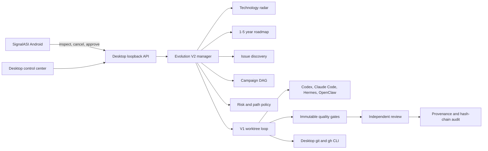

# Self-Evolution V2

SignalASI Self-Evolution V2 turns research, product signals, and runtime failures into isolated,
reviewable source candidates. It extends the existing V1 Git worktree execution loop; it does not
replace the stable application or grant an Agent direct access to production.

## System boundaries



The control plane stores tasks, research, proposals, roadmaps, campaigns, policy decisions,
reviews, provenance, and audit events. The execution plane uses disposable Git worktrees,
Agent processes, compilers, test backends, and an optional dedicated Android test device.
The production plane is never used as a candidate workspace.

## State model

```text
proposed
  -> preparing
  -> running
  -> validating
  -> waiting_approval
  -> publishing
  -> published

failed attempt
  -> delete its worktree and branch
  -> retry in a new worktree while attempts remain
  -> failed
```

Cancellation can stop a running task. Rollback discards a candidate waiting for approval. An
interrupted publish returns to `waiting_approval`; an interrupted execution is rolled back and may
resume in a fresh worktree.

Research objects never execute code. A proposal becomes executable only after an explicit
`materialize` operation creates a scoped V1 task.

## Persistent data

The default state root is `%APPDATA%/SignalASI/evolution` on Windows:

```text
tasks/
worktrees/
logs/
v2/
  audit/events.jsonl
  campaigns/
  issues/
  proposals/
  provenance/
  research/
  roadmaps/
  scheduler/
  snapshots/
  task-metadata/
```

Set `SIGNALASI_STATE_DIR` to move state and `SIGNALASI_SOURCE_ROOT` to select the real SignalASI
Git checkout. Worktrees must remain outside that checkout.

## Compatibility

`evolution_manager.py` is a compatibility facade. The exact V1 implementation from the target
checkout lives in `evolution_v2/legacy.py`; all V1 names, including private helpers used by current
tests, are re-exported. V2 overrides only `EvolutionManager`, `evolution_manager`, and
`default_evolution_patch_agent`.

## Configuration

- `config/evolution-policy.json`: protected paths, risk escalation, limits, review, and publish
  policy.
- `config/evolution-gates.json`: immutable quality gate definitions.
- `config/evolution-sources.json`: trusted organizations, known repositories, discovery queries,
  fit terms, and allowed licenses.
- `config/evolution-scheduler.json`: research and diagnostic schedules.

The scheduler creates research evidence, issue signals, and proposals. It does not automatically
publish or merge source changes.
